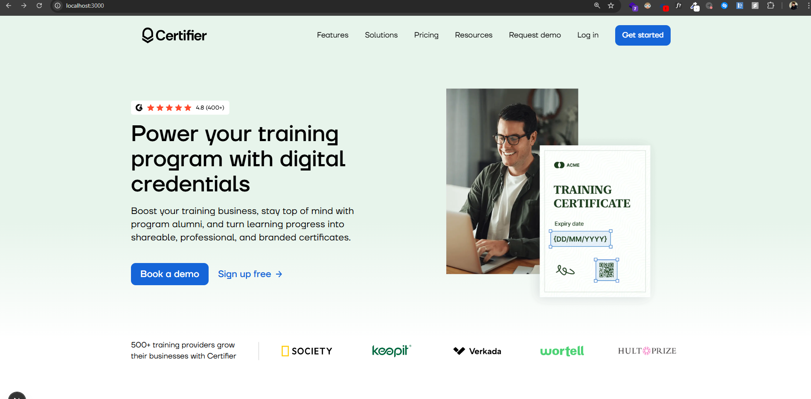

# Certifier Frontend Challenge

## 🚀 About The Project

This is my implementation of the **Certifier Frontend Challenge**. The goal was to build a responsive, pixel-perfect landing page based on a provided Figma design.

The project was built using **Next.js 14** (with App Router), **TypeScript**, and **Tailwind CSS**, with a strong focus on clean architecture, semantic HTML, and accessibility.

---

## 🖥️ Live Demo & Preview

You can view and test the live version of the application deployed on Vercel:

**[https://certifier-challenge.vercel.app/](https://certifier-challenge.vercel.app/)**

Below is a screenshot of the final page on a desktop view:



---

## ✨ Key Features

- **Pixel-Perfect Fidelity**: The page was implemented with great attention to detail to match the Figma design as closely as possible.
- **Fully Responsive**: The layout fluidly adapts to various screen sizes, from mobile devices to wide desktop monitors.
- **Accessibility in Mind**: Built with semantic HTML and basic ARIA attributes to ensure the page is more accessible to users of assistive technologies.
- **Modern Tech Stack**: Utilizes the latest standards and tools, including Next.js App Router and TypeScript.
- **Component-Based Architecture**: A logical and clean project structure based on reusable components.
- **Interactive UI**: Includes subtle transitions and hover states to enhance the user experience (UX).

---

## 🛠️ Tech Stack

- **Framework**: [Next.js 14](https://nextjs.org/) (App Router)
- **Language**: [TypeScript](https://www.typescriptlang.org/)
- **Styling**: [Tailwind CSS](https://tailwindcss.com/)
- **Icons**: [Lucide React](https://lucide.dev/)
- **Tooling & Libraries**:
  - `clsx` & `tailwind-merge` for conditional class name management.
  - `ESLint` & `Prettier` for code quality and consistency.

---

## 📁 Project Structure

```
├── app/                    # Main directory for routing and pages (App Router)
│   ├── layout.tsx          # Root layout component
│   └── page.tsx            # Homepage component
├── components/             # Reusable React components
│   ├── sections/           # Larger page sections (e.g., Hero, Trust)
│   ├── ui/                 # Small, generic UI components (e.g., Button)
│   └── Navbar/             # Navigation component with its logic
├── lib/                    # Helper files (e.g., utils.ts with the cn function)
├── public/                 # Static assets (fonts, images)
├── .eslintrc.json          # ESLint configuration
├── next.config.mjs         # Next.js configuration
└── tailwind.config.ts      # Tailwind CSS configuration
```

## ⚙️ Installation and Setup

To run this project locally, follow these steps:

1.  **Clone the repository:**

    git clone [https://github.com/hubert-grzesiak/certifier-challenge.git](https://github.com/hubert-grzesiak/certifier-challenge.git)

2.  **Navigate to the project directory:**

    ```bash
    cd certifier-challenge
    ```

3.  **Install dependencies:**

    ```bash
    npm install
    # or
    # yarn install
    # or
    # pnpm install
    ```

4.  **Run the development server:**

    ```bash
    npm run dev
    ```

5.  **Open the application in your browser** at [http://localhost:3000](http://localhost:3000).

---

## 📝 My Comments

- I paid special attention to creating a clean component structure that would make future development and maintenance easier.
- In the `Navbar` component, I implemented accessibility basics, such as keyboard navigation for the mobile menu and appropriate ARIA attributes, to provide a better experience for all users.

Thank you for the opportunity to take on this challenge! 😊
